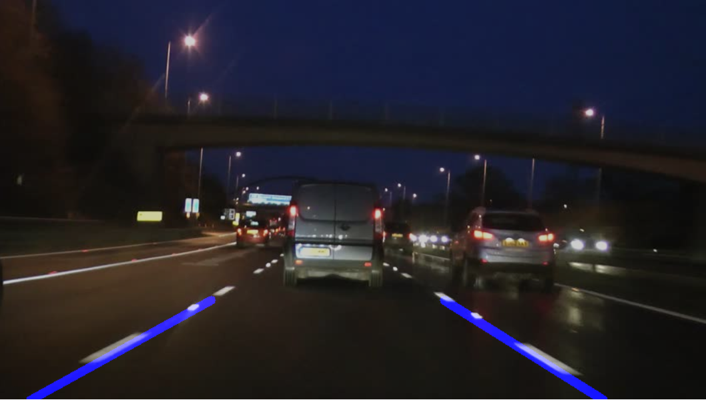

# Lane Detection

## Overview
* Preprocess image or video frame and extract region of interest (ROI)
* Find the lines in the ROI and determine the lanes using first order polynomials
* Display lanes on image

## Project Components
* Images: Contains vechicle dashcam images used to test lane detection
* Results: Contains resulting images of lane detection 
* LaneDetection.py: Class containing LaneDetection class
* main.py: Uses LaneDetection class on input images to find lanes and display them  

## Results

